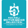
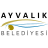
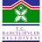
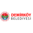
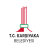
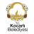
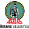
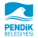

# Anatolia Icons

Türk kamu kurumları, üniversiteler, teknoloji ve ödeme markalarının SVG logoları ile Anadolu kilim motiflerini sunan açık kaynak ikon kütüphanesi.


<p align="center">
  
  &nbsp;
  
  &nbsp;
  
  &nbsp;
  
  &nbsp;
  
  &nbsp;
  
  &nbsp;
  
  &nbsp;
  
  &nbsp;
  
  &nbsp;
  
</p>

345 ikon · 7 kategori. Tam liste aşağıda: [İkon kataloğu](#ikon-kataloğu).

## Kurulum

```bash
pnpm add @anatolia-icons/react
# veya
npm install @anatolia-icons/react
```

Saf SVG dosyaları için:

```bash
pnpm add @anatolia-icons/svg
```

`react` 18+ peer dependency olarak gerekir.

## Kullanım

Tüm kütüphaneden named import (tree-shaking uyumlu):

```tsx
import { AselsanIcon, TroyIcon } from '@anatolia-icons/react';

export function Example() {
  return (
    <>
      <AselsanIcon size={32} title="ASELSAN" />
      <TroyIcon color="#00AEEF" className="h-8 w-8" />
    </>
  );
}
```

Yalnızca bir kategori (daha küçük bundle):

```tsx
import { GaziUniIcon, OdtuIcon } from '@anatolia-icons/react/universite';
```

Tailwind ile renk ve boyut:

```tsx
import { EdevletIcon } from '@anatolia-icons/react/kamu';

<EdevletIcon className="h-6 w-6 text-red-600" />
```

Kategori slug'ları:


| Import yolu                                  | Açıklama                         |
| -------------------------------------------- | -------------------------------- |
| `@anatolia-icons/react`                      | Tüm ikonlar + `brands` metadata  |
| `@anatolia-icons/react/kamu`                 | Kamu & devlet kurumları          |
| `@anatolia-icons/react/universite`           | Devlet üniversiteleri            |
| `@anatolia-icons/react/teknoloji`            | Teknoloji, savunma & açık kaynak |
| `@anatolia-icons/react/finans`               | Finans & ödeme standartları      |
| `@anatolia-icons/react/belediye`             | Büyükşehir belediyeleri          |
| `@anatolia-icons/react/gokturk`              | Göktürk alfabesi                 |
| `@anatolia-icons/react/motif`                | Anadolu kilim motifleri          |
| `@anatolia-icons/react/brands`               | Vitrin / filtre için katalog     |


```ts
import { brands } from '@anatolia-icons/react/brands';
```

### IconProps

| Prop        | Tip               | Varsayılan     | Açıklama                 |
| ----------- | ----------------- | -------------- | ------------------------ |
| `size`      | `number | string` | `24`           | Genişlik ve yükseklik    |
| `color`     | `string`          | `currentColor` | Fill rengi               |
| `title`     | `string`          | —              | Erişilebilir SVG başlığı |
| `className` | `string`          | —              | Tailwind / CSS sınıfı    |

Kalan SVG özellikleri (`aria-*`, `onClick`, …) köke aktarılır.

## İkon kataloğu

Bu ızgara `brands.json` üzerinden otomatik üretilir; elle düzenlemeyin. Yeni logo ekledikten sonra `.\.dev\run-build.ps1` veya `pnpm optimize` yeterlidir.

<!-- CATALOG:START -->
### Kamu & Devlet Kurumları

<table>
<tr>
<td align="center" valign="top" width="16.67%">
<br/>
<sub><b>e-Devlet Kapısı</b></sub><br/>
<sub><code>EdevletIcon</code></sub>
</td>
<td align="center" valign="top" width="16.67%">
<br/>
<sub><b>T.C. Cumhurbaşkanlığı Forsu</b></sub><br/>
<sub><code>TcCumhurbaskanligiIcon</code></sub>
</td>
<td align="center" valign="top" width="16.67%">
<br/>
<sub><b>TÜBİTAK</b></sub><br/>
<sub><code>TubitakIcon</code></sub>
</td>
<td align="center" valign="top" width="16.67%">
<br/>
<sub><b>PTT</b></sub><br/>
<sub><code>PttIcon</code></sub>
</td>
<td align="center" valign="top" width="16.67%">
<br/>
<sub><b>TCDD</b></sub><br/>
<sub><code>TcddIcon</code></sub>
</td>
<td align="center" valign="top" width="16.67%">
<br/>
<sub><b>Karayolları Genel Müdürlüğü</b></sub><br/>
<sub><code>KgmIcon</code></sub>
</td>
</tr>
<tr>
<td align="center" valign="top" width="16.67%">
<br/>
<sub><b>Türk Standardları Enstitüsü</b></sub><br/>
<sub><code>TseIcon</code></sub>
</td>
<td width="16.67%"></td>
<td width="16.67%"></td>
<td width="16.67%"></td>
<td width="16.67%"></td>
<td width="16.67%"></td>
</tr>
</table>

### Devlet Üniversiteleri

<table>
<tr>
<td align="center" valign="top" width="16.67%">
<br/>
<sub><b>Gazi Üniversitesi</b></sub><br/>
<sub><code>GaziUniIcon</code></sub>
</td>
<td align="center" valign="top" width="16.67%">
<br/>
<sub><b>Orta Doğu Teknik Üniversitesi</b></sub><br/>
<sub><code>OdtuIcon</code></sub>
</td>
<td align="center" valign="top" width="16.67%">
<br/>
<sub><b>İstanbul Teknik Üniversitesi</b></sub><br/>
<sub><code>ItuIcon</code></sub>
</td>
<td align="center" valign="top" width="16.67%">
<br/>
<sub><b>Boğaziçi Üniversitesi</b></sub><br/>
<sub><code>BounIcon</code></sub>
</td>
<td align="center" valign="top" width="16.67%">
<br/>
<sub><b>Ankara Üniversitesi</b></sub><br/>
<sub><code>AnkaraUniIcon</code></sub>
</td>
<td align="center" valign="top" width="16.67%">
<br/>
<sub><b>Kocaeli Üniversitesi</b></sub><br/>
<sub><code>KocaeliUniIcon</code></sub>
</td>
</tr>
<tr>
<td align="center" valign="top" width="16.67%">
<br/>
<sub><b>Abdullah Gül Üniversitesi</b></sub><br/>
<sub><code>AguIcon</code></sub>
</td>
<td align="center" valign="top" width="16.67%">
<br/>
<sub><b>Adıyaman Üniversitesi</b></sub><br/>
<sub><code>AdiyamanIcon</code></sub>
</td>
<td align="center" valign="top" width="16.67%">
<br/>
<sub><b>Altınbaş Üniversitesi</b></sub><br/>
<sub><code>AltinbasIcon</code></sub>
</td>
<td align="center" valign="top" width="16.67%">
<br/>
<sub><b>Amasya Üniversitesi</b></sub><br/>
<sub><code>AmasyaIcon</code></sub>
</td>
<td align="center" valign="top" width="16.67%">
<br/>
<sub><b>Anadolu Üniversitesi</b></sub><br/>
<sub><code>AnadoluIcon</code></sub>
</td>
<td align="center" valign="top" width="16.67%">
<br/>
<sub><b>Ankara Hacı Bayram Veli Üniversitesi</b></sub><br/>
<sub><code>HacibayramIcon</code></sub>
</td>
</tr>
<tr>
<td align="center" valign="top" width="16.67%">
<br/>
<sub><b>Ankara Yıldırım Beyazıt Üniversitesi</b></sub><br/>
<sub><code>AybuIcon</code></sub>
</td>
<td align="center" valign="top" width="16.67%">
<br/>
<sub><b>Antalya Belek Üniversitesi</b></sub><br/>
<sub><code>BelekIcon</code></sub>
</td>
<td align="center" valign="top" width="16.67%">
<br/>
<sub><b>Antalya Bilim Üniversitesi</b></sub><br/>
<sub><code>AntalyaIcon</code></sub>
</td>
<td align="center" valign="top" width="16.67%">
<br/>
<sub><b>Ataşehir Adıgüzel Meslek Yüksekokulu</b></sub><br/>
<sub><code>AdiguzelIcon</code></sub>
</td>
<td align="center" valign="top" width="16.67%">
<br/>
<sub><b>Atılım Üniversitesi</b></sub><br/>
<sub><code>AtilimIcon</code></sub>
</td>
<td align="center" valign="top" width="16.67%">
<br/>
<sub><b>Aydın Adnan Menderes Üniversitesi</b></sub><br/>
<sub><code>AduIcon</code></sub>
</td>
</tr>
<tr>
<td align="center" valign="top" width="16.67%">
<br/>
<sub><b>Bayburt Üniversitesi</b></sub><br/>
<sub><code>BayburtIcon</code></sub>
</td>
<td align="center" valign="top" width="16.67%">
<br/>
<sub><b>Başkent Üniversitesi</b></sub><br/>
<sub><code>BaskentIcon</code></sub>
</td>
<td align="center" valign="top" width="16.67%">
<br/>
<sub><b>Beykoz Üniversitesi</b></sub><br/>
<sub><code>BeykozIcon</code></sub>
</td>
<td align="center" valign="top" width="16.67%">
<br/>
<sub><b>Biruni Üniversitesi</b></sub><br/>
<sub><code>BiruniIcon</code></sub>
</td>
<td align="center" valign="top" width="16.67%">
<br/>
<sub><b>Burdur Mehmet Akif Ersoy Üniversitesi</b></sub><br/>
<sub><code>MehmetakifIcon</code></sub>
</td>
<td align="center" valign="top" width="16.67%">
<br/>
<sub><b>Bursa Uludağ Üniversitesi</b></sub><br/>
<sub><code>UludagIcon</code></sub>
</td>
</tr>
<tr>
<td align="center" valign="top" width="16.67%">
<br/>
<sub><b>Düzce Üniversitesi</b></sub><br/>
<sub><code>DuzceIcon</code></sub>
</td>
<td align="center" valign="top" width="16.67%">
<br/>
<sub><b>Ege Üniversitesi</b></sub><br/>
<sub><code>EgeIcon</code></sub>
</td>
<td align="center" valign="top" width="16.67%">
<br/>
<sub><b>Erciyes Üniversitesi</b></sub><br/>
<sub><code>ErciyesIcon</code></sub>
</td>
<td align="center" valign="top" width="16.67%">
<br/>
<sub><b>Erzincan Binali Yıldırım Üniversitesi</b></sub><br/>
<sub><code>EbyuIcon</code></sub>
</td>
<td align="center" valign="top" width="16.67%">
<br/>
<sub><b>Erzurum Teknik Üniversitesi</b></sub><br/>
<sub><code>ErzurumIcon</code></sub>
</td>
<td align="center" valign="top" width="16.67%">
<br/>
<sub><b>Eskişehir Teknik Üniversitesi</b></sub><br/>
<sub><code>EskisehirIcon</code></sub>
</td>
</tr>
<tr>
<td align="center" valign="top" width="16.67%">
<br/>
<sub><b>Fatih Sultan Mehmet Vakıf Üniversitesi</b></sub><br/>
<sub><code>FsmIcon</code></sub>
</td>
<td align="center" valign="top" width="16.67%">
<br/>
<sub><b>Fenerbahçe Üniversitesi</b></sub><br/>
<sub><code>FbuIcon</code></sub>
</td>
<td align="center" valign="top" width="16.67%">
<br/>
<sub><b>Fırat Üniversitesi</b></sub><br/>
<sub><code>FiratIcon</code></sub>
</td>
<td align="center" valign="top" width="16.67%">
<br/>
<sub><b>Gaziantep Üniversitesi</b></sub><br/>
<sub><code>GantepIcon</code></sub>
</td>
<td align="center" valign="top" width="16.67%">
<br/>
<sub><b>Gümüşhane Üniversitesi</b></sub><br/>
<sub><code>GumushaneIcon</code></sub>
</td>
<td align="center" valign="top" width="16.67%">
<br/>
<sub><b>Hacettepe Üniversitesi</b></sub><br/>
<sub><code>HacettepeIcon</code></sub>
</td>
</tr>
<tr>
<td align="center" valign="top" width="16.67%">
<br/>
<sub><b>Hakkari Üniversitesi</b></sub><br/>
<sub><code>HakkariIcon</code></sub>
</td>
<td align="center" valign="top" width="16.67%">
<br/>
<sub><b>Haliç Üniversitesi</b></sub><br/>
<sub><code>HalicIcon</code></sub>
</td>
<td align="center" valign="top" width="16.67%">
<br/>
<sub><b>Hitit Üniversitesi</b></sub><br/>
<sub><code>HititIcon</code></sub>
</td>
<td align="center" valign="top" width="16.67%">
<br/>
<sub><b>Iğdır Üniversitesi</b></sub><br/>
<sub><code>IgdirIcon</code></sub>
</td>
<td align="center" valign="top" width="16.67%">
<br/>
<sub><b>Kafkas Üniversitesi</b></sub><br/>
<sub><code>KafkasIcon</code></sub>
</td>
<td align="center" valign="top" width="16.67%">
<br/>
<sub><b>Karadeniz Teknik Üniversitesi</b></sub><br/>
<sub><code>KtuIcon</code></sub>
</td>
</tr>
<tr>
<td align="center" valign="top" width="16.67%">
<br/>
<sub><b>Konya Teknik Üniversitesi</b></sub><br/>
<sub><code>KtunIcon</code></sub>
</td>
<td align="center" valign="top" width="16.67%">
<br/>
<sub><b>Koç Üniversitesi</b></sub><br/>
<sub><code>KuIcon</code></sub>
</td>
<td align="center" valign="top" width="16.67%">
<br/>
<sub><b>Kırıkkale Üniversitesi</b></sub><br/>
<sub><code>KkuIcon</code></sub>
</td>
<td align="center" valign="top" width="16.67%">
<br/>
<sub><b>Kırşehir Ahi Evran Üniversitesi</b></sub><br/>
<sub><code>AhievranIcon</code></sub>
</td>
<td align="center" valign="top" width="16.67%">
<br/>
<sub><b>Lokman Hekim Üniversitesi</b></sub><br/>
<sub><code>LokmanhekimIcon</code></sub>
</td>
<td align="center" valign="top" width="16.67%">
<br/>
<sub><b>Malatya Turgut Özal Üniversitesi</b></sub><br/>
<sub><code>OzalIcon</code></sub>
</td>
</tr>
<tr>
<td align="center" valign="top" width="16.67%">
<br/>
<sub><b>Mardin Artuklu Üniversitesi</b></sub><br/>
<sub><code>ArtukluIcon</code></sub>
</td>
<td align="center" valign="top" width="16.67%">
<br/>
<sub><b>Marmara Üniversitesi</b></sub><br/>
<sub><code>MarmaraIcon</code></sub>
</td>
<td align="center" valign="top" width="16.67%">
<br/>
<sub><b>Mersin Üniversitesi</b></sub><br/>
<sub><code>MersinIcon</code></sub>
</td>
<td align="center" valign="top" width="16.67%">
<br/>
<sub><b>Mimar Sinan Güzel Sanatlar Üniversitesi</b></sub><br/>
<sub><code>MsgsuIcon</code></sub>
</td>
<td align="center" valign="top" width="16.67%">
<br/>
<sub><b>Munzur Üniversitesi</b></sub><br/>
<sub><code>MunzurIcon</code></sub>
</td>
<td align="center" valign="top" width="16.67%">
<br/>
<sub><b>Muğla Sıtkı Koçman Üniversitesi</b></sub><br/>
<sub><code>MuIcon</code></sub>
</td>
</tr>
<tr>
<td align="center" valign="top" width="16.67%">
<br/>
<sub><b>Muş Alparslan Üniversitesi</b></sub><br/>
<sub><code>AlparslanIcon</code></sub>
</td>
<td align="center" valign="top" width="16.67%">
<br/>
<sub><b>Niğde Ömer Halisdemir Üniversitesi</b></sub><br/>
<sub><code>OhuIcon</code></sub>
</td>
<td align="center" valign="top" width="16.67%">
<br/>
<sub><b>Ondokuz Mayıs Üniversitesi</b></sub><br/>
<sub><code>OmuIcon</code></sub>
</td>
<td align="center" valign="top" width="16.67%">
<br/>
<sub><b>Ordu Üniversitesi</b></sub><br/>
<sub><code>OduIcon</code></sub>
</td>
<td align="center" valign="top" width="16.67%">
<br/>
<sub><b>Pamukkale Üniversitesi</b></sub><br/>
<sub><code>PauIcon</code></sub>
</td>
<td align="center" valign="top" width="16.67%">
<br/>
<sub><b>Sabancı Üniversitesi</b></sub><br/>
<sub><code>SabanciunivIcon</code></sub>
</td>
</tr>
<tr>
<td align="center" valign="top" width="16.67%">
<br/>
<sub><b>Sakarya Uygulamalı Bilimler Üniversitesi</b></sub><br/>
<sub><code>SubuIcon</code></sub>
</td>
<td align="center" valign="top" width="16.67%">
<br/>
<sub><b>Sakarya Üniversitesi</b></sub><br/>
<sub><code>SakaryaIcon</code></sub>
</td>
<td align="center" valign="top" width="16.67%">
<br/>
<sub><b>Sanko Üniversitesi</b></sub><br/>
<sub><code>SankoIcon</code></sub>
</td>
<td align="center" valign="top" width="16.67%">
<br/>
<sub><b>Tarsus Üniversitesi</b></sub><br/>
<sub><code>TarsusIcon</code></sub>
</td>
<td align="center" valign="top" width="16.67%">
<br/>
<sub><b>Tekirdağ Namık Kemal Üniversitesi</b></sub><br/>
<sub><code>NkuIcon</code></sub>
</td>
<td align="center" valign="top" width="16.67%">
<br/>
<sub><b>Tokat Gaziosmanpaşa Üniversitesi</b></sub><br/>
<sub><code>GopIcon</code></sub>
</td>
</tr>
<tr>
<td align="center" valign="top" width="16.67%">
<br/>
<sub><b>Uşak Üniversitesi</b></sub><br/>
<sub><code>UsakIcon</code></sub>
</td>
<td align="center" valign="top" width="16.67%">
<br/>
<sub><b>Yıldız Teknik Üniversitesi</b></sub><br/>
<sub><code>YildizUniversiteIcon</code></sub>
</td>
<td align="center" valign="top" width="16.67%">
<br/>
<sub><b>Çankırı Karatekin Üniversitesi</b></sub><br/>
<sub><code>KaratekinIcon</code></sub>
</td>
<td align="center" valign="top" width="16.67%">
<br/>
<sub><b>Çukurova Üniversitesi</b></sub><br/>
<sub><code>CuIcon</code></sub>
</td>
<td align="center" valign="top" width="16.67%">
<br/>
<sub><b>Özyeğin Üniversitesi</b></sub><br/>
<sub><code>OzyeginIcon</code></sub>
</td>
<td align="center" valign="top" width="16.67%">
<br/>
<sub><b>İbn Haldun Üniversitesi</b></sub><br/>
<sub><code>IhuIcon</code></sub>
</td>
</tr>
<tr>
<td align="center" valign="top" width="16.67%">
<br/>
<sub><b>İstanbul 29 Mayıs Üniversitesi</b></sub><br/>
<sub><code>YirmiDokuzMayisIcon</code></sub>
</td>
<td align="center" valign="top" width="16.67%">
<br/>
<sub><b>İstanbul Arel Üniversitesi</b></sub><br/>
<sub><code>ArelIcon</code></sub>
</td>
<td align="center" valign="top" width="16.67%">
<br/>
<sub><b>İstanbul Atlas Üniversitesi</b></sub><br/>
<sub><code>AtlasIcon</code></sub>
</td>
<td align="center" valign="top" width="16.67%">
<br/>
<sub><b>İstanbul Aydın Üniversitesi</b></sub><br/>
<sub><code>AydinIcon</code></sub>
</td>
<td align="center" valign="top" width="16.67%">
<br/>
<sub><b>İstanbul Bilgi Üniversitesi</b></sub><br/>
<sub><code>BilgiIcon</code></sub>
</td>
<td align="center" valign="top" width="16.67%">
<br/>
<sub><b>İstanbul Kültür Üniversitesi</b></sub><br/>
<sub><code>IkuIcon</code></sub>
</td>
</tr>
<tr>
<td align="center" valign="top" width="16.67%">
<br/>
<sub><b>İstanbul Medeniyet Üniversitesi</b></sub><br/>
<sub><code>MedeniyetIcon</code></sub>
</td>
<td align="center" valign="top" width="16.67%">
<br/>
<sub><b>İstanbul Sağlık ve Teknoloji Üniversitesi</b></sub><br/>
<sub><code>IstunIcon</code></sub>
</td>
<td align="center" valign="top" width="16.67%">
<br/>
<sub><b>İstanbul Topkapı Üniversitesi</b></sub><br/>
<sub><code>TopkapiIcon</code></sub>
</td>
<td align="center" valign="top" width="16.67%">
<br/>
<sub><b>İstanbul Üniversitesi</b></sub><br/>
<sub><code>IstanbulIcon</code></sub>
</td>
<td align="center" valign="top" width="16.67%">
<br/>
<sub><b>İstanbul Üniversitesi-cerrahpaşa</b></sub><br/>
<sub><code>IucIcon</code></sub>
</td>
<td align="center" valign="top" width="16.67%">
<br/>
<sub><b>İstanbul Şişli Meslek Yüksekokulu</b></sub><br/>
<sub><code>SisliIcon</code></sub>
</td>
</tr>
<tr>
<td align="center" valign="top" width="16.67%">
<br/>
<sub><b>İstinye Üniversitesi</b></sub><br/>
<sub><code>IstinyeIcon</code></sub>
</td>
<td align="center" valign="top" width="16.67%">
<br/>
<sub><b>İzmir Bakırçay Üniversitesi</b></sub><br/>
<sub><code>BakircayIcon</code></sub>
</td>
<td width="16.67%"></td>
<td width="16.67%"></td>
<td width="16.67%"></td>
<td width="16.67%"></td>
</tr>
</table>

### Teknoloji, Savunma & Açık Kaynak

<table>
<tr>
<td align="center" valign="top" width="16.67%">
<br/>
<sub><b>Pardus</b></sub><br/>
<sub><code>PardusIcon</code></sub>
</td>
<td align="center" valign="top" width="16.67%">
<br/>
<sub><b>ASELSAN</b></sub><br/>
<sub><code>AselsanIcon</code></sub>
</td>
<td align="center" valign="top" width="16.67%">
<br/>
<sub><b>HAVELSAN</b></sub><br/>
<sub><code>HavelsanIcon</code></sub>
</td>
<td align="center" valign="top" width="16.67%">
<br/>
<sub><b>ROKETSAN</b></sub><br/>
<sub><code>RoketsanIcon</code></sub>
</td>
<td align="center" valign="top" width="16.67%">
<br/>
<sub><b>Kodluyoruz</b></sub><br/>
<sub><code>KodluyoruzIcon</code></sub>
</td>
<td align="center" valign="top" width="16.67%">
<br/>
<sub><b>Linux Kullanıcıları Derneği</b></sub><br/>
<sub><code>LkdIcon</code></sub>
</td>
</tr>
</table>

### Finans & Ödeme Standartları

<table>
<tr>
<td align="center" valign="top" width="16.67%">
<br/>
<sub><b>Türk Lirası Simgesi (₺)</b></sub><br/>
<sub><code>TlSimgesiIcon</code></sub>
</td>
<td align="center" valign="top" width="16.67%">
<br/>
<sub><b>TROY</b></sub><br/>
<sub><code>TroyIcon</code></sub>
</td>
<td align="center" valign="top" width="16.67%">
<br/>
<sub><b>BKM Express</b></sub><br/>
<sub><code>BkmIcon</code></sub>
</td>
<td width="16.67%"></td>
<td width="16.67%"></td>
<td width="16.67%"></td>
</tr>
</table>

### Büyükşehir Belediyeleri

<table>
<tr>
<td align="center" valign="top" width="16.67%">
<br/>
<sub><b>İstanbul Büyükşehir Belediyesi</b></sub><br/>
<sub><code>IbbIcon</code></sub>
</td>
<td align="center" valign="top" width="16.67%">
<br/>
<sub><b>Ankara Büyükşehir Belediyesi</b></sub><br/>
<sub><code>AbbIcon</code></sub>
</td>
<td align="center" valign="top" width="16.67%">
<br/>
<sub><b>Kocaeli Büyükşehir Belediyesi</b></sub><br/>
<sub><code>KocaeliBbIcon</code></sub>
</td>
<td align="center" valign="top" width="16.67%">
<br/>
<sub><b>Adapazarı Belediyesi</b></sub><br/>
<sub><code>AdapazariBelIcon</code></sub>
</td>
<td align="center" valign="top" width="16.67%">
<br/>
<sub><b>Adıyaman Belediyesi</b></sub><br/>
<sub><code>AdiyamanBelIcon</code></sub>
</td>
<td align="center" valign="top" width="16.67%">
<br/>
<sub><b>Ağrı Belediyesi</b></sub><br/>
<sub><code>AgriBelIcon</code></sub>
</td>
</tr>
<tr>
<td align="center" valign="top" width="16.67%">
<br/>
<sub><b>Aliağa Belediyesi</b></sub><br/>
<sub><code>AliagaBelIcon</code></sub>
</td>
<td align="center" valign="top" width="16.67%">
<br/>
<sub><b>Altındağ Belediyesi</b></sub><br/>
<sub><code>AltindagBelIcon</code></sub>
</td>
<td align="center" valign="top" width="16.67%">
<br/>
<sub><b>Altınözü Belediyesi</b></sub><br/>
<sub><code>AltinozuBelIcon</code></sub>
</td>
<td align="center" valign="top" width="16.67%">
<br/>
<sub><b>Arifiye Belediyesi</b></sub><br/>
<sub><code>ArifiyeBelIcon</code></sub>
</td>
<td align="center" valign="top" width="16.67%">
<br/>
<sub><b>Armutlu Belediyesi</b></sub><br/>
<sub><code>ArmutluBelIcon</code></sub>
</td>
<td align="center" valign="top" width="16.67%">
<br/>
<sub><b>Arnavutköy Belediyesi</b></sub><br/>
<sub><code>ArnavutkoyBelIcon</code></sub>
</td>
</tr>
<tr>
<td align="center" valign="top" width="16.67%">
<br/>
<sub><b>Arsin Belediyesi</b></sub><br/>
<sub><code>ArsinBelIcon</code></sub>
</td>
<td align="center" valign="top" width="16.67%">
<br/>
<sub><b>Arsuz Belediyesi</b></sub><br/>
<sub><code>ArsuzBelIcon</code></sub>
</td>
<td align="center" valign="top" width="16.67%">
<br/>
<sub><b>Atakum Belediyesi</b></sub><br/>
<sub><code>AtakumBelIcon</code></sub>
</td>
<td align="center" valign="top" width="16.67%">
<br/>
<sub><b>Avanos Belediyesi</b></sub><br/>
<sub><code>AvanosBelIcon</code></sub>
</td>
<td align="center" valign="top" width="16.67%">
<br/>
<sub><b>Ayaş Belediyesi</b></sub><br/>
<sub><code>AyasBelIcon</code></sub>
</td>
<td align="center" valign="top" width="16.67%">
<br/>
<sub><b>Aydıntepe Belediyesi</b></sub><br/>
<sub><code>AydintepeBelIcon</code></sub>
</td>
</tr>
<tr>
<td align="center" valign="top" width="16.67%">
<br/>
<sub><b>Ayvalık Belediyesi</b></sub><br/>
<sub><code>AyvalikBelIcon</code></sub>
</td>
<td align="center" valign="top" width="16.67%">
<br/>
<sub><b>Bahçelievler Belediyesi</b></sub><br/>
<sub><code>BahcelievlerBelIcon</code></sub>
</td>
<td align="center" valign="top" width="16.67%">
<br/>
<sub><b>Balçova Belediyesi</b></sub><br/>
<sub><code>BalcovaBelIcon</code></sub>
</td>
<td align="center" valign="top" width="16.67%">
<br/>
<sub><b>Başakşehir Belediyesi</b></sub><br/>
<sub><code>BasaksehirBelIcon</code></sub>
</td>
<td align="center" valign="top" width="16.67%">
<br/>
<sub><b>Başiskele Belediyesi</b></sub><br/>
<sub><code>BasiskeleBelIcon</code></sub>
</td>
<td align="center" valign="top" width="16.67%">
<br/>
<sub><b>Bayburt Belediyesi</b></sub><br/>
<sub><code>BayburtBelIcon</code></sub>
</td>
</tr>
<tr>
<td align="center" valign="top" width="16.67%">
<br/>
<sub><b>Bayraklı Belediyesi</b></sub><br/>
<sub><code>BayrakliBelIcon</code></sub>
</td>
<td align="center" valign="top" width="16.67%">
<br/>
<sub><b>Beyağaç Belediyesi</b></sub><br/>
<sub><code>BeyagacBelIcon</code></sub>
</td>
<td align="center" valign="top" width="16.67%">
<br/>
<sub><b>Beylikova Belediyesi</b></sub><br/>
<sub><code>BeylikovaBelIcon</code></sub>
</td>
<td align="center" valign="top" width="16.67%">
<br/>
<sub><b>Beypazarı Belediyesi</b></sub><br/>
<sub><code>BeypazariBelIcon</code></sub>
</td>
<td align="center" valign="top" width="16.67%">
<br/>
<sub><b>Biga Belediyesi</b></sub><br/>
<sub><code>BigaBelIcon</code></sub>
</td>
<td align="center" valign="top" width="16.67%">
<br/>
<sub><b>Boğazkale Belediyesi</b></sub><br/>
<sub><code>BogazkaleBelIcon</code></sub>
</td>
</tr>
<tr>
<td align="center" valign="top" width="16.67%">
<br/>
<sub><b>Boğazlıyan Belediyesi</b></sub><br/>
<sub><code>BogazliyanBelIcon</code></sub>
</td>
<td align="center" valign="top" width="16.67%">
<br/>
<sub><b>Bornova Belediyesi</b></sub><br/>
<sub><code>BornovaBelIcon</code></sub>
</td>
<td align="center" valign="top" width="16.67%">
<br/>
<sub><b>Bozdoğan Belediyesi</b></sub><br/>
<sub><code>BozdoganBelIcon</code></sub>
</td>
<td align="center" valign="top" width="16.67%">
<br/>
<sub><b>Bozkurt Belediyesi</b></sub><br/>
<sub><code>BozkurtBelIcon</code></sub>
</td>
<td align="center" valign="top" width="16.67%">
<br/>
<sub><b>Buca Belediyesi</b></sub><br/>
<sub><code>BucaBelIcon</code></sub>
</td>
<td align="center" valign="top" width="16.67%">
<br/>
<sub><b>Bursa Büyükşehir Belediyesi</b></sub><br/>
<sub><code>BursaBelIcon</code></sub>
</td>
</tr>
<tr>
<td align="center" valign="top" width="16.67%">
<br/>
<sub><b>Çadırkaya Belediyesi</b></sub><br/>
<sub><code>CadirkayaBelIcon</code></sub>
</td>
<td align="center" valign="top" width="16.67%">
<br/>
<sub><b>Çamoluk Belediyesi</b></sub><br/>
<sub><code>CamolukBelIcon</code></sub>
</td>
<td align="center" valign="top" width="16.67%">
<br/>
<sub><b>Çankırı Belediyesi</b></sub><br/>
<sub><code>CankiriBelIcon</code></sub>
</td>
<td align="center" valign="top" width="16.67%">
<br/>
<sub><b>Çaybaşı Belediyesi</b></sub><br/>
<sub><code>CaybasiBelIcon</code></sub>
</td>
<td align="center" valign="top" width="16.67%">
<br/>
<sub><b>Çayıralan Belediyesi</b></sub><br/>
<sub><code>CayiralanBelIcon</code></sub>
</td>
<td align="center" valign="top" width="16.67%">
<br/>
<sub><b>Çayırova Belediyesi</b></sub><br/>
<sub><code>CayirovaBelIcon</code></sub>
</td>
</tr>
<tr>
<td align="center" valign="top" width="16.67%">
<br/>
<sub><b>Çekmeköy Belediyesi</b></sub><br/>
<sub><code>CekmekoyBelIcon</code></sub>
</td>
<td align="center" valign="top" width="16.67%">
<br/>
<sub><b>Çemişgezek Belediyesi</b></sub><br/>
<sub><code>CemisgezekBelIcon</code></sub>
</td>
<td align="center" valign="top" width="16.67%">
<br/>
<sub><b>Çerkezköy Belediyesi</b></sub><br/>
<sub><code>CerkezkoyBelIcon</code></sub>
</td>
<td align="center" valign="top" width="16.67%">
<br/>
<sub><b>Çeşme Belediyesi</b></sub><br/>
<sub><code>CesmeBelIcon</code></sub>
</td>
<td align="center" valign="top" width="16.67%">
<br/>
<sub><b>Çilimli Belediyesi</b></sub><br/>
<sub><code>CilimliBelIcon</code></sub>
</td>
<td align="center" valign="top" width="16.67%">
<br/>
<sub><b>Çukurca Belediyesi</b></sub><br/>
<sub><code>CukurcaBelIcon</code></sub>
</td>
</tr>
<tr>
<td align="center" valign="top" width="16.67%">
<br/>
<sub><b>Cumayeri Belediyesi</b></sub><br/>
<sub><code>CumayeriBelIcon</code></sub>
</td>
<td align="center" valign="top" width="16.67%">
<br/>
<sub><b>Demirköy Belediyesi</b></sub><br/>
<sub><code>DemirkoyBelIcon</code></sub>
</td>
<td align="center" valign="top" width="16.67%">
<br/>
<sub><b>Demirözü Belediyesi</b></sub><br/>
<sub><code>DemirozuBelIcon</code></sub>
</td>
<td align="center" valign="top" width="16.67%">
<br/>
<sub><b>Dumlupınar Belediyesi</b></sub><br/>
<sub><code>DumlupinarBelIcon</code></sub>
</td>
<td align="center" valign="top" width="16.67%">
<br/>
<sub><b>Dursunbey Belediyesi</b></sub><br/>
<sub><code>DursunbeyBelIcon</code></sub>
</td>
<td align="center" valign="top" width="16.67%">
<br/>
<sub><b>Düziçi Belediyesi</b></sub><br/>
<sub><code>DuziciBelIcon</code></sub>
</td>
</tr>
<tr>
<td align="center" valign="top" width="16.67%">
<br/>
<sub><b>Edirne Belediyesi</b></sub><br/>
<sub><code>EdirneBelIcon</code></sub>
</td>
<td align="center" valign="top" width="16.67%">
<br/>
<sub><b>Efeler Belediyesi</b></sub><br/>
<sub><code>EfelerBelIcon</code></sub>
</td>
<td align="center" valign="top" width="16.67%">
<br/>
<sub><b>Elmadağ Belediyesi</b></sub><br/>
<sub><code>ElmadagBelIcon</code></sub>
</td>
<td align="center" valign="top" width="16.67%">
<br/>
<sub><b>Emet Belediyesi</b></sub><br/>
<sub><code>EmetBelIcon</code></sub>
</td>
<td align="center" valign="top" width="16.67%">
<br/>
<sub><b>Erdemli Belediyesi</b></sub><br/>
<sub><code>ErdemliBelIcon</code></sub>
</td>
<td align="center" valign="top" width="16.67%">
<br/>
<sub><b>Ereğli Belediyesi</b></sub><br/>
<sub><code>EregliBelIcon</code></sub>
</td>
</tr>
<tr>
<td align="center" valign="top" width="16.67%">
<br/>
<sub><b>Erenler Belediyesi</b></sub><br/>
<sub><code>ErenlerBelIcon</code></sub>
</td>
<td align="center" valign="top" width="16.67%">
<br/>
<sub><b>Erzincan Belediyesi</b></sub><br/>
<sub><code>ErzincanBelIcon</code></sub>
</td>
<td align="center" valign="top" width="16.67%">
<br/>
<sub><b>Esenler Belediyesi</b></sub><br/>
<sub><code>EsenlerBelIcon</code></sub>
</td>
<td align="center" valign="top" width="16.67%">
<br/>
<sub><b>Eşme Belediyesi</b></sub><br/>
<sub><code>EsmeBelIcon</code></sub>
</td>
<td align="center" valign="top" width="16.67%">
<br/>
<sub><b>Eynesil Belediyesi</b></sub><br/>
<sub><code>EynesilBelIcon</code></sub>
</td>
<td align="center" valign="top" width="16.67%">
<br/>
<sub><b>Fatih Belediyesi</b></sub><br/>
<sub><code>FatihBelIcon</code></sub>
</td>
</tr>
<tr>
<td align="center" valign="top" width="16.67%">
<br/>
<sub><b>Fethiye Belediyesi</b></sub><br/>
<sub><code>FethiyeBelIcon</code></sub>
</td>
<td align="center" valign="top" width="16.67%">
<br/>
<sub><b>Gebze Belediyesi</b></sub><br/>
<sub><code>GebzeBelIcon</code></sub>
</td>
<td align="center" valign="top" width="16.67%">
<br/>
<sub><b>Germencik Belediyesi</b></sub><br/>
<sub><code>GermencikBelIcon</code></sub>
</td>
<td align="center" valign="top" width="16.67%">
<br/>
<sub><b>Gölbaşı Belediyesi</b></sub><br/>
<sub><code>GolbasiBelIcon</code></sub>
</td>
<td align="center" valign="top" width="16.67%">
<br/>
<sub><b>Gölbaşı Belediyesi</b></sub><br/>
<sub><code>GolbasiAnkaraBelIcon</code></sub>
</td>
<td align="center" valign="top" width="16.67%">
<br/>
<sub><b>Gölyaka Belediyesi</b></sub><br/>
<sub><code>GolyakaBelIcon</code></sub>
</td>
</tr>
<tr>
<td align="center" valign="top" width="16.67%">
<br/>
<sub><b>Gümüşgöze Belediyesi</b></sub><br/>
<sub><code>GumusgozeBelIcon</code></sub>
</td>
<td align="center" valign="top" width="16.67%">
<br/>
<sub><b>Gürçayır Belediyesi</b></sub><br/>
<sub><code>GurcayirBelIcon</code></sub>
</td>
<td align="center" valign="top" width="16.67%">
<br/>
<sub><b>Gürpınar Belediyesi</b></sub><br/>
<sub><code>GurpinarBelIcon</code></sub>
</td>
<td align="center" valign="top" width="16.67%">
<br/>
<sub><b>Hacılar Belediyesi</b></sub><br/>
<sub><code>HacilarBelIcon</code></sub>
</td>
<td align="center" valign="top" width="16.67%">
<br/>
<sub><b>Haymana Belediyesi</b></sub><br/>
<sub><code>HaymanaBelIcon</code></sub>
</td>
<td align="center" valign="top" width="16.67%">
<br/>
<sub><b>Hendek Belediyesi</b></sub><br/>
<sub><code>HendekBelIcon</code></sub>
</td>
</tr>
<tr>
<td align="center" valign="top" width="16.67%">
<br/>
<sub><b>Hüyük Belediyesi</b></sub><br/>
<sub><code>HuyukBelIcon</code></sub>
</td>
<td align="center" valign="top" width="16.67%">
<br/>
<sub><b>İğneada Belediyesi</b></sub><br/>
<sub><code>IgneadaBelIcon</code></sub>
</td>
<td align="center" valign="top" width="16.67%">
<br/>
<sub><b>İncirliova Belediyesi</b></sub><br/>
<sub><code>IncirliovaBelIcon</code></sub>
</td>
<td align="center" valign="top" width="16.67%">
<br/>
<sub><b>İnegöl Belediyesi</b></sub><br/>
<sub><code>InegolBelIcon</code></sub>
</td>
<td align="center" valign="top" width="16.67%">
<br/>
<sub><b>Isparta Belediyesi</b></sub><br/>
<sub><code>IspartaBelIcon</code></sub>
</td>
<td align="center" valign="top" width="16.67%">
<br/>
<sub><b>İzmir Büyükşehir Belediyesi</b></sub><br/>
<sub><code>IzmirBelIcon</code></sub>
</td>
</tr>
<tr>
<td align="center" valign="top" width="16.67%">
<br/>
<sub><b>İzmit Belediyesi</b></sub><br/>
<sub><code>IzmitBelIcon</code></sub>
</td>
<td align="center" valign="top" width="16.67%">
<br/>
<sub><b>Kadıköy Belediyesi</b></sub><br/>
<sub><code>KadikoyBelIcon</code></sub>
</td>
<td align="center" valign="top" width="16.67%">
<br/>
<sub><b>Kahramankazan Belediyesi</b></sub><br/>
<sub><code>KahramankazanBelIcon</code></sub>
</td>
<td align="center" valign="top" width="16.67%">
<br/>
<sub><b>Kalecik Belediyesi</b></sub><br/>
<sub><code>KalecikBelIcon</code></sub>
</td>
<td align="center" valign="top" width="16.67%">
<br/>
<sub><b>Kalkandere Belediyesi</b></sub><br/>
<sub><code>KalkandereBelIcon</code></sub>
</td>
<td align="center" valign="top" width="16.67%">
<br/>
<sub><b>Karabağlar Belediyesi</b></sub><br/>
<sub><code>KarabaglarBelIcon</code></sub>
</td>
</tr>
<tr>
<td align="center" valign="top" width="16.67%">
<br/>
<sub><b>Karaburun Belediyesi</b></sub><br/>
<sub><code>KaraburunBelIcon</code></sub>
</td>
<td align="center" valign="top" width="16.67%">
<br/>
<sub><b>Karaman Belediyesi</b></sub><br/>
<sub><code>KaramanBelIcon</code></sub>
</td>
<td align="center" valign="top" width="16.67%">
<br/>
<sub><b>Karamürsel Belediyesi</b></sub><br/>
<sub><code>KaramurselBelIcon</code></sub>
</td>
<td align="center" valign="top" width="16.67%">
<br/>
<sub><b>Karayaka Belediyesi</b></sub><br/>
<sub><code>KarayakaBelIcon</code></sub>
</td>
<td align="center" valign="top" width="16.67%">
<br/>
<sub><b>Karesi Belediyesi</b></sub><br/>
<sub><code>KaresiBelIcon</code></sub>
</td>
<td align="center" valign="top" width="16.67%">
<br/>
<sub><b>Karşıyaka Belediyesi</b></sub><br/>
<sub><code>KarsiyakaBelIcon</code></sub>
</td>
</tr>
<tr>
<td align="center" valign="top" width="16.67%">
<br/>
<sub><b>Kastamonu Belediyesi</b></sub><br/>
<sub><code>KastamonuBelIcon</code></sub>
</td>
<td align="center" valign="top" width="16.67%">
<br/>
<sub><b>Kavaklı Belediyesi</b></sub><br/>
<sub><code>KavakliBelIcon</code></sub>
</td>
<td align="center" valign="top" width="16.67%">
<br/>
<sub><b>Kayapınar Belediyesi</b></sub><br/>
<sub><code>KayapinarBelIcon</code></sub>
</td>
<td align="center" valign="top" width="16.67%">
<br/>
<sub><b>Kepsut Belediyesi</b></sub><br/>
<sub><code>KepsutBelIcon</code></sub>
</td>
<td align="center" valign="top" width="16.67%">
<br/>
<sub><b>Kestel Belediyesi</b></sub><br/>
<sub><code>KestelBelIcon</code></sub>
</td>
<td align="center" valign="top" width="16.67%">
<br/>
<sub><b>Kırıkhan Belediyesi</b></sub><br/>
<sub><code>KirikhanBelIcon</code></sub>
</td>
</tr>
<tr>
<td align="center" valign="top" width="16.67%">
<br/>
<sub><b>Kırşehir Belediyesi</b></sub><br/>
<sub><code>KirsehirBelIcon</code></sub>
</td>
<td align="center" valign="top" width="16.67%">
<br/>
<sub><b>Kocaali Belediyesi</b></sub><br/>
<sub><code>KocaaliBelIcon</code></sub>
</td>
<td align="center" valign="top" width="16.67%">
<br/>
<sub><b>Kocaeli Büyükşehir Belediyesi</b></sub><br/>
<sub><code>KocaeliBelIcon</code></sub>
</td>
<td align="center" valign="top" width="16.67%">
<br/>
<sub><b>Koçarlı Belediyesi</b></sub><br/>
<sub><code>KocarliBelIcon</code></sub>
</td>
<td align="center" valign="top" width="16.67%">
<br/>
<sub><b>Kocasinan Belediyesi</b></sub><br/>
<sub><code>KocasinanBelIcon</code></sub>
</td>
<td align="center" valign="top" width="16.67%">
<br/>
<sub><b>Kofçaz Belediyesi</b></sub><br/>
<sub><code>KofcazBelIcon</code></sub>
</td>
</tr>
<tr>
<td align="center" valign="top" width="16.67%">
<br/>
<sub><b>Konak Belediyesi</b></sub><br/>
<sub><code>KonakBelIcon</code></sub>
</td>
<td align="center" valign="top" width="16.67%">
<br/>
<sub><b>Konyaaltı Belediyesi</b></sub><br/>
<sub><code>KonyaaltiBelIcon</code></sub>
</td>
<td align="center" valign="top" width="16.67%">
<br/>
<sub><b>Koru Belediyesi</b></sub><br/>
<sub><code>KoruBelIcon</code></sub>
</td>
<td align="center" valign="top" width="16.67%">
<br/>
<sub><b>Kovancılar Belediyesi</b></sub><br/>
<sub><code>KovancilarBelIcon</code></sub>
</td>
<td align="center" valign="top" width="16.67%">
<br/>
<sub><b>Küçükçekmece Belediyesi</b></sub><br/>
<sub><code>KucukcekmeceBelIcon</code></sub>
</td>
<td align="center" valign="top" width="16.67%">
<br/>
<sub><b>Kula Belediyesi</b></sub><br/>
<sub><code>KulaBelIcon</code></sub>
</td>
</tr>
<tr>
<td align="center" valign="top" width="16.67%">
<br/>
<sub><b>Kuleönü Belediyesi</b></sub><br/>
<sub><code>KuleonuBelIcon</code></sub>
</td>
<td align="center" valign="top" width="16.67%">
<br/>
<sub><b>Kuşadası Belediyesi</b></sub><br/>
<sub><code>KusadasiBelIcon</code></sub>
</td>
<td align="center" valign="top" width="16.67%">
<br/>
<sub><b>Kuyucak Belediyesi</b></sub><br/>
<sub><code>KuyucakBelIcon</code></sub>
</td>
<td align="center" valign="top" width="16.67%">
<br/>
<sub><b>Lüleburgaz Belediyesi</b></sub><br/>
<sub><code>LuleburgazBelIcon</code></sub>
</td>
<td align="center" valign="top" width="16.67%">
<br/>
<sub><b>Mamak Belediyesi</b></sub><br/>
<sub><code>MamakBelIcon</code></sub>
</td>
<td align="center" valign="top" width="16.67%">
<br/>
<sub><b>Meram Belediyesi</b></sub><br/>
<sub><code>MeramBelIcon</code></sub>
</td>
</tr>
<tr>
<td align="center" valign="top" width="16.67%">
<br/>
<sub><b>Merkezefendi Belediyesi</b></sub><br/>
<sub><code>MerkezefendiBelIcon</code></sub>
</td>
<td align="center" valign="top" width="16.67%">
<br/>
<sub><b>Mollaköy Belediyesi</b></sub><br/>
<sub><code>MollakoyBelIcon</code></sub>
</td>
<td align="center" valign="top" width="16.67%">
<br/>
<sub><b>Muğla Büyükşehir Belediyesi</b></sub><br/>
<sub><code>MuglaBelIcon</code></sub>
</td>
<td align="center" valign="top" width="16.67%">
<br/>
<sub><b>Muratpaşa Belediyesi</b></sub><br/>
<sub><code>MuratpasaBelIcon</code></sub>
</td>
<td align="center" valign="top" width="16.67%">
<br/>
<sub><b>Murgul Belediyesi</b></sub><br/>
<sub><code>MurgulBelIcon</code></sub>
</td>
<td align="center" valign="top" width="16.67%">
<br/>
<sub><b>Niksar Belediyesi</b></sub><br/>
<sub><code>NiksarBelIcon</code></sub>
</td>
</tr>
<tr>
<td align="center" valign="top" width="16.67%">
<br/>
<sub><b>Nilüfer Belediyesi</b></sub><br/>
<sub><code>NiluferBelIcon</code></sub>
</td>
<td align="center" valign="top" width="16.67%">
<br/>
<sub><b>Nurdağı Belediyesi</b></sub><br/>
<sub><code>NurdagiBelIcon</code></sub>
</td>
<td align="center" valign="top" width="16.67%">
<br/>
<sub><b>Ödemiş Belediyesi</b></sub><br/>
<sub><code>OdemisBelIcon</code></sub>
</td>
<td align="center" valign="top" width="16.67%">
<br/>
<sub><b>Odunpazarı Belediyesi</b></sub><br/>
<sub><code>OdunpazariBelIcon</code></sub>
</td>
<td align="center" valign="top" width="16.67%">
<br/>
<sub><b>Ören Belediyesi</b></sub><br/>
<sub><code>OrenBelIcon</code></sub>
</td>
<td align="center" valign="top" width="16.67%">
<br/>
<sub><b>Orhaneli Belediyesi</b></sub><br/>
<sub><code>OrhaneliBelIcon</code></sub>
</td>
</tr>
<tr>
<td align="center" valign="top" width="16.67%">
<br/>
<sub><b>Orhangazi Belediyesi</b></sub><br/>
<sub><code>OrhangaziBelIcon</code></sub>
</td>
<td align="center" valign="top" width="16.67%">
<br/>
<sub><b>Osmaniye Belediyesi</b></sub><br/>
<sub><code>OsmaniyeBelIcon</code></sub>
</td>
<td align="center" valign="top" width="16.67%">
<br/>
<sub><b>Palandöken Belediyesi</b></sub><br/>
<sub><code>PalandokenBelIcon</code></sub>
</td>
<td align="center" valign="top" width="16.67%">
<br/>
<sub><b>Pazaryeri Belediyesi</b></sub><br/>
<sub><code>PazaryeriBelIcon</code></sub>
</td>
<td align="center" valign="top" width="16.67%">
<br/>
<sub><b>Pehlivanköy Belediyesi</b></sub><br/>
<sub><code>PehlivankoyBelIcon</code></sub>
</td>
<td align="center" valign="top" width="16.67%">
<br/>
<sub><b>Pendik Belediyesi</b></sub><br/>
<sub><code>PendikBelIcon</code></sub>
</td>
</tr>
<tr>
<td align="center" valign="top" width="16.67%">
<br/>
<sub><b>Pertek Belediyesi</b></sub><br/>
<sub><code>PertekBelIcon</code></sub>
</td>
<td align="center" valign="top" width="16.67%">
<br/>
<sub><b>Polatlı Belediyesi</b></sub><br/>
<sub><code>PolatliBelIcon</code></sub>
</td>
<td align="center" valign="top" width="16.67%">
<br/>
<sub><b>Refahiye Belediyesi</b></sub><br/>
<sub><code>RefahiyeBelIcon</code></sub>
</td>
<td align="center" valign="top" width="16.67%">
<br/>
<sub><b>Sakarya Büyükşehir Belediyesi</b></sub><br/>
<sub><code>SakaryaBelIcon</code></sub>
</td>
<td align="center" valign="top" width="16.67%">
<br/>
<sub><b>Saltukova Belediyesi</b></sub><br/>
<sub><code>SaltukovaBelIcon</code></sub>
</td>
<td align="center" valign="top" width="16.67%">
<br/>
<sub><b>Samsun Büyükşehir Belediyesi</b></sub><br/>
<sub><code>SamsunBelIcon</code></sub>
</td>
</tr>
<tr>
<td align="center" valign="top" width="16.67%">
<br/>
<sub><b>Selçuklu Belediyesi</b></sub><br/>
<sub><code>SelcukluBelIcon</code></sub>
</td>
<td align="center" valign="top" width="16.67%">
<br/>
<sub><b>Seydişehir Belediyesi</b></sub><br/>
<sub><code>SeydisehirBelIcon</code></sub>
</td>
<td align="center" valign="top" width="16.67%">
<br/>
<sub><b>Seyitgazi Belediyesi</b></sub><br/>
<sub><code>SeyitgaziBelIcon</code></sub>
</td>
<td align="center" valign="top" width="16.67%">
<br/>
<sub><b>Silivri Belediyesi</b></sub><br/>
<sub><code>SilivriBelIcon</code></sub>
</td>
<td align="center" valign="top" width="16.67%">
<br/>
<sub><b>Simav Belediyesi</b></sub><br/>
<sub><code>SimavBelIcon</code></sub>
</td>
<td align="center" valign="top" width="16.67%">
<br/>
<sub><b>Sincan Belediyesi</b></sub><br/>
<sub><code>SincanBelIcon</code></sub>
</td>
</tr>
<tr>
<td align="center" valign="top" width="16.67%">
<br/>
<sub><b>Sızır Belediyesi</b></sub><br/>
<sub><code>SizirBelIcon</code></sub>
</td>
<td align="center" valign="top" width="16.67%">
<br/>
<sub><b>Söke Belediyesi</b></sub><br/>
<sub><code>SokeBelIcon</code></sub>
</td>
<td align="center" valign="top" width="16.67%">
<br/>
<sub><b>Şuhut Belediyesi</b></sub><br/>
<sub><code>SuhutBelIcon</code></sub>
</td>
<td align="center" valign="top" width="16.67%">
<br/>
<sub><b>Süleymanpaşa Belediyesi</b></sub><br/>
<sub><code>SuleymanpasaBelIcon</code></sub>
</td>
<td align="center" valign="top" width="16.67%">
<br/>
<sub><b>Sultanbeyli Belediyesi</b></sub><br/>
<sub><code>SultanbeyliBelIcon</code></sub>
</td>
<td align="center" valign="top" width="16.67%">
<br/>
<sub><b>Sultangazi Belediyesi</b></sub><br/>
<sub><code>SultangaziBelIcon</code></sub>
</td>
</tr>
<tr>
<td align="center" valign="top" width="16.67%">
<br/>
<sub><b>Sultanhanı Belediyesi</b></sub><br/>
<sub><code>SultanhaniBelIcon</code></sub>
</td>
<td align="center" valign="top" width="16.67%">
<br/>
<sub><b>Tanoba Belediyesi</b></sub><br/>
<sub><code>TanobaBelIcon</code></sub>
</td>
<td align="center" valign="top" width="16.67%">
<br/>
<sub><b>Tefenni Belediyesi</b></sub><br/>
<sub><code>TefenniBelIcon</code></sub>
</td>
<td align="center" valign="top" width="16.67%">
<br/>
<sub><b>Tekirdağ Büyükşehir Belediyesi</b></sub><br/>
<sub><code>TekirdagBelIcon</code></sub>
</td>
<td align="center" valign="top" width="16.67%">
<br/>
<sub><b>Tepebaşı Belediyesi</b></sub><br/>
<sub><code>TepebasiBelIcon</code></sub>
</td>
<td align="center" valign="top" width="16.67%">
<br/>
<sub><b>Tercan Belediyesi</b></sub><br/>
<sub><code>TercanBelIcon</code></sub>
</td>
</tr>
<tr>
<td align="center" valign="top" width="16.67%">
<br/>
<sub><b>Tillo Belediyesi</b></sub><br/>
<sub><code>TilloBelIcon</code></sub>
</td>
<td align="center" valign="top" width="16.67%">
<br/>
<sub><b>Tirebolu Belediyesi</b></sub><br/>
<sub><code>TireboluBelIcon</code></sub>
</td>
<td align="center" valign="top" width="16.67%">
<br/>
<sub><b>Trabzon Büyükşehir Belediyesi</b></sub><br/>
<sub><code>TrabzonBelIcon</code></sub>
</td>
<td align="center" valign="top" width="16.67%">
<br/>
<sub><b>Tunçbilek Belediyesi</b></sub><br/>
<sub><code>TuncbilekBelIcon</code></sub>
</td>
<td align="center" valign="top" width="16.67%">
<br/>
<sub><b>Türkmen Belediyesi</b></sub><br/>
<sub><code>TurkmenBelIcon</code></sub>
</td>
<td align="center" valign="top" width="16.67%">
<br/>
<sub><b>Tuzla Belediyesi</b></sub><br/>
<sub><code>TuzlaBelIcon</code></sub>
</td>
</tr>
<tr>
<td align="center" valign="top" width="16.67%">
<br/>
<sub><b>Ulus Belediyesi</b></sub><br/>
<sub><code>UlusBelIcon</code></sub>
</td>
<td align="center" valign="top" width="16.67%">
<br/>
<sub><b>Ümraniye Belediyesi</b></sub><br/>
<sub><code>UmraniyeBelIcon</code></sub>
</td>
<td align="center" valign="top" width="16.67%">
<br/>
<sub><b>Ünlüpınar Belediyesi</b></sub><br/>
<sub><code>UnlupinarBelIcon</code></sub>
</td>
<td align="center" valign="top" width="16.67%">
<br/>
<sub><b>Ünye Belediyesi</b></sub><br/>
<sub><code>UnyeBelIcon</code></sub>
</td>
<td align="center" valign="top" width="16.67%">
<br/>
<sub><b>Ürgüp Belediyesi</b></sub><br/>
<sub><code>UrgupBelIcon</code></sub>
</td>
<td align="center" valign="top" width="16.67%">
<br/>
<sub><b>Van Büyükşehir Belediyesi</b></sub><br/>
<sub><code>VanBelIcon</code></sub>
</td>
</tr>
<tr>
<td align="center" valign="top" width="16.67%">
<br/>
<sub><b>Vize Belediyesi</b></sub><br/>
<sub><code>VizeBelIcon</code></sub>
</td>
<td align="center" valign="top" width="16.67%">
<br/>
<sub><b>Yakutiye Belediyesi</b></sub><br/>
<sub><code>YakutiyeBelIcon</code></sub>
</td>
<td align="center" valign="top" width="16.67%">
<br/>
<sub><b>Yalıhüyük Belediyesi</b></sub><br/>
<sub><code>YalihuyukBelIcon</code></sub>
</td>
<td align="center" valign="top" width="16.67%">
<br/>
<sub><b>Yalova Belediyesi</b></sub><br/>
<sub><code>YalovaBelIcon</code></sub>
</td>
<td align="center" valign="top" width="16.67%">
<br/>
<sub><b>Yarbaşı Belediyesi</b></sub><br/>
<sub><code>YarbasiBelIcon</code></sub>
</td>
<td align="center" valign="top" width="16.67%">
<br/>
<sub><b>Yerköy Belediyesi</b></sub><br/>
<sub><code>YerkoyBelIcon</code></sub>
</td>
</tr>
<tr>
<td align="center" valign="top" width="16.67%">
<br/>
<sub><b>Yeşilyurt Belediyesi</b></sub><br/>
<sub><code>YesilyurtBelIcon</code></sub>
</td>
<td align="center" valign="top" width="16.67%">
<br/>
<sub><b>Yıldızeli Belediyesi</b></sub><br/>
<sub><code>YildizeliBelIcon</code></sub>
</td>
<td align="center" valign="top" width="16.67%">
<br/>
<sub><b>Yozgat Belediyesi</b></sub><br/>
<sub><code>YozgatBelIcon</code></sub>
</td>
<td align="center" valign="top" width="16.67%">
<br/>
<sub><b>Yumurtalık Belediyesi</b></sub><br/>
<sub><code>YumurtalikBelIcon</code></sub>
</td>
<td align="center" valign="top" width="16.67%">
<br/>
<sub><b>Yunusemre Belediyesi</b></sub><br/>
<sub><code>YunusemreBelIcon</code></sub>
</td>
<td width="16.67%"></td>
</tr>
</table>

### Göktürk Alfabesi

<table>
<tr>
<td align="center" valign="top" width="16.67%">
<br/>
<sub><b>Göktürk harfi A</b></sub><br/>
<sub><code>GokturkAIcon</code></sub>
</td>
<td align="center" valign="top" width="16.67%">
<br/>
<sub><b>Göktürk harfi B1</b></sub><br/>
<sub><code>GokturkB1Icon</code></sub>
</td>
<td align="center" valign="top" width="16.67%">
<br/>
<sub><b>Göktürk harfi B2</b></sub><br/>
<sub><code>GokturkB2Icon</code></sub>
</td>
<td align="center" valign="top" width="16.67%">
<br/>
<sub><b>Göktürk harfi CH</b></sub><br/>
<sub><code>GokturkChIcon</code></sub>
</td>
<td align="center" valign="top" width="16.67%">
<br/>
<sub><b>Göktürk harfi D1</b></sub><br/>
<sub><code>GokturkD1Icon</code></sub>
</td>
<td align="center" valign="top" width="16.67%">
<br/>
<sub><b>Göktürk harfi D2</b></sub><br/>
<sub><code>GokturkD2Icon</code></sub>
</td>
</tr>
<tr>
<td align="center" valign="top" width="16.67%">
<br/>
<sub><b>Göktürk harfi G1</b></sub><br/>
<sub><code>GokturkG1Icon</code></sub>
</td>
<td align="center" valign="top" width="16.67%">
<br/>
<sub><b>Göktürk harfi G2</b></sub><br/>
<sub><code>GokturkG2Icon</code></sub>
</td>
<td align="center" valign="top" width="16.67%">
<br/>
<sub><b>Göktürk harfi I</b></sub><br/>
<sub><code>GokturkIIcon</code></sub>
</td>
<td align="center" valign="top" width="16.67%">
<br/>
<sub><b>Göktürk harfi ICH</b></sub><br/>
<sub><code>GokturkIchIcon</code></sub>
</td>
<td align="center" valign="top" width="16.67%">
<br/>
<sub><b>Göktürk harfi IQ</b></sub><br/>
<sub><code>GokturkIqIcon</code></sub>
</td>
<td align="center" valign="top" width="16.67%">
<br/>
<sub><b>Göktürk harfi K</b></sub><br/>
<sub><code>GokturkKIcon</code></sub>
</td>
</tr>
<tr>
<td align="center" valign="top" width="16.67%">
<br/>
<sub><b>Göktürk harfi L1</b></sub><br/>
<sub><code>GokturkL1Icon</code></sub>
</td>
<td align="center" valign="top" width="16.67%">
<br/>
<sub><b>Göktürk harfi L2</b></sub><br/>
<sub><code>GokturkL2Icon</code></sub>
</td>
<td align="center" valign="top" width="16.67%">
<br/>
<sub><b>Göktürk harfi LT</b></sub><br/>
<sub><code>GokturkLtIcon</code></sub>
</td>
<td align="center" valign="top" width="16.67%">
<br/>
<sub><b>Göktürk harfi M</b></sub><br/>
<sub><code>GokturkMIcon</code></sub>
</td>
<td align="center" valign="top" width="16.67%">
<br/>
<sub><b>Göktürk harfi N1</b></sub><br/>
<sub><code>GokturkN1Icon</code></sub>
</td>
<td align="center" valign="top" width="16.67%">
<br/>
<sub><b>Göktürk harfi N2</b></sub><br/>
<sub><code>GokturkN2Icon</code></sub>
</td>
</tr>
<tr>
<td align="center" valign="top" width="16.67%">
<br/>
<sub><b>Göktürk harfi NCH</b></sub><br/>
<sub><code>GokturkNchIcon</code></sub>
</td>
<td align="center" valign="top" width="16.67%">
<br/>
<sub><b>Göktürk harfi NG</b></sub><br/>
<sub><code>GokturkNgIcon</code></sub>
</td>
<td align="center" valign="top" width="16.67%">
<br/>
<sub><b>Göktürk harfi NT</b></sub><br/>
<sub><code>GokturkNtIcon</code></sub>
</td>
<td align="center" valign="top" width="16.67%">
<br/>
<sub><b>Göktürk harfi NY</b></sub><br/>
<sub><code>GokturkNyIcon</code></sub>
</td>
<td align="center" valign="top" width="16.67%">
<br/>
<sub><b>Göktürk harfi O</b></sub><br/>
<sub><code>GokturkOIcon</code></sub>
</td>
<td align="center" valign="top" width="16.67%">
<br/>
<sub><b>Göktürk harfi OQ</b></sub><br/>
<sub><code>GokturkOqIcon</code></sub>
</td>
</tr>
<tr>
<td align="center" valign="top" width="16.67%">
<br/>
<sub><b>Göktürk harfi P</b></sub><br/>
<sub><code>GokturkPIcon</code></sub>
</td>
<td align="center" valign="top" width="16.67%">
<br/>
<sub><b>Göktürk harfi Q</b></sub><br/>
<sub><code>GokturkQIcon</code></sub>
</td>
<td align="center" valign="top" width="16.67%">
<br/>
<sub><b>Göktürk harfi R1</b></sub><br/>
<sub><code>GokturkR1Icon</code></sub>
</td>
<td align="center" valign="top" width="16.67%">
<br/>
<sub><b>Göktürk harfi R2</b></sub><br/>
<sub><code>GokturkR2Icon</code></sub>
</td>
<td align="center" valign="top" width="16.67%">
<br/>
<sub><b>Göktürk harfi S1</b></sub><br/>
<sub><code>GokturkS1Icon</code></sub>
</td>
<td align="center" valign="top" width="16.67%">
<br/>
<sub><b>Göktürk harfi S2</b></sub><br/>
<sub><code>GokturkS2Icon</code></sub>
</td>
</tr>
<tr>
<td align="center" valign="top" width="16.67%">
<br/>
<sub><b>Göktürk harfi SEP</b></sub><br/>
<sub><code>GokturkSepIcon</code></sub>
</td>
<td align="center" valign="top" width="16.67%">
<br/>
<sub><b>Göktürk harfi SH</b></sub><br/>
<sub><code>GokturkShIcon</code></sub>
</td>
<td align="center" valign="top" width="16.67%">
<br/>
<sub><b>Göktürk harfi T1</b></sub><br/>
<sub><code>GokturkT1Icon</code></sub>
</td>
<td align="center" valign="top" width="16.67%">
<br/>
<sub><b>Göktürk harfi T2</b></sub><br/>
<sub><code>GokturkT2Icon</code></sub>
</td>
<td align="center" valign="top" width="16.67%">
<br/>
<sub><b>Göktürk harfi U</b></sub><br/>
<sub><code>GokturkUIcon</code></sub>
</td>
<td align="center" valign="top" width="16.67%">
<br/>
<sub><b>Göktürk harfi UK</b></sub><br/>
<sub><code>GokturkUkIcon</code></sub>
</td>
</tr>
<tr>
<td align="center" valign="top" width="16.67%">
<br/>
<sub><b>Göktürk harfi Y1</b></sub><br/>
<sub><code>GokturkY1Icon</code></sub>
</td>
<td align="center" valign="top" width="16.67%">
<br/>
<sub><b>Göktürk harfi Y2</b></sub><br/>
<sub><code>GokturkY2Icon</code></sub>
</td>
<td align="center" valign="top" width="16.67%">
<br/>
<sub><b>Göktürk harfi Z</b></sub><br/>
<sub><code>GokturkZIcon</code></sub>
</td>
<td width="16.67%"></td>
<td width="16.67%"></td>
<td width="16.67%"></td>
</tr>
</table>

### Anadolu Kilim Motifleri

<table>
<tr>
<td align="center" valign="top" width="16.67%">
<br/>
<sub><b>Eli Belinde</b></sub><br/>
<sub><code>EliBelindeIcon</code></sub>
</td>
<td align="center" valign="top" width="16.67%">
<br/>
<sub><b>Koçboynuzu</b></sub><br/>
<sub><code>KocBoynuzuIcon</code></sub>
</td>
<td align="center" valign="top" width="16.67%">
<br/>
<sub><b>Hayat Ağacı</b></sub><br/>
<sub><code>HayatAgaciIcon</code></sub>
</td>
<td align="center" valign="top" width="16.67%">
<br/>
<sub><b>Bereket</b></sub><br/>
<sub><code>BereketIcon</code></sub>
</td>
<td align="center" valign="top" width="16.67%">
<br/>
<sub><b>Aşk ve Birleşim</b></sub><br/>
<sub><code>AskVeBirlesimIcon</code></sub>
</td>
<td align="center" valign="top" width="16.67%">
<br/>
<sub><b>Göz</b></sub><br/>
<sub><code>GozIcon</code></sub>
</td>
</tr>
<tr>
<td align="center" valign="top" width="16.67%">
<br/>
<sub><b>Göz 2</b></sub><br/>
<sub><code>Goz2Icon</code></sub>
</td>
<td align="center" valign="top" width="16.67%">
<br/>
<sub><b>Muska</b></sub><br/>
<sub><code>MuskaIcon</code></sub>
</td>
<td align="center" valign="top" width="16.67%">
<br/>
<sub><b>Akrep</b></sub><br/>
<sub><code>AkrepIcon</code></sub>
</td>
<td align="center" valign="top" width="16.67%">
<br/>
<sub><b>Pıtrak</b></sub><br/>
<sub><code>PitrakIcon</code></sub>
</td>
<td align="center" valign="top" width="16.67%">
<br/>
<sub><b>Çengel</b></sub><br/>
<sub><code>CengelIcon</code></sub>
</td>
<td align="center" valign="top" width="16.67%">
<br/>
<sub><b>Tarak</b></sub><br/>
<sub><code>TarakIcon</code></sub>
</td>
</tr>
<tr>
<td align="center" valign="top" width="16.67%">
<br/>
<sub><b>Tarak 2</b></sub><br/>
<sub><code>Tarak2Icon</code></sub>
</td>
<td align="center" valign="top" width="16.67%">
<br/>
<sub><b>Yıldız</b></sub><br/>
<sub><code>YildizMotifIcon</code></sub>
</td>
<td align="center" valign="top" width="16.67%">
<br/>
<sub><b>Yıldız 2</b></sub><br/>
<sub><code>Yildiz2Icon</code></sub>
</td>
<td align="center" valign="top" width="16.67%">
<br/>
<sub><b>İnsan</b></sub><br/>
<sub><code>InsanIcon</code></sub>
</td>
<td align="center" valign="top" width="16.67%">
<br/>
<sub><b>Bukağı</b></sub><br/>
<sub><code>BukagiIcon</code></sub>
</td>
<td align="center" valign="top" width="16.67%">
<br/>
<sub><b>Sandıklı</b></sub><br/>
<sub><code>SandikliIcon</code></sub>
</td>
</tr>
<tr>
<td align="center" valign="top" width="16.67%">
<br/>
<sub><b>Saçbağı</b></sub><br/>
<sub><code>SacbagiIcon</code></sub>
</td>
<td width="16.67%"></td>
<td width="16.67%"></td>
<td width="16.67%"></td>
<td width="16.67%"></td>
<td width="16.67%"></td>
</tr>
</table>
<!-- CATALOG:END -->

## Geliştirme

```bash
pnpm install
pnpm build
```

`pnpm build` sırası: `optimize` (SVGO) → README önizleme (48×48 viewport) → README katalog ızgarası → `build:react` (SVGR) → `tsup` (ESM + CJS + d.ts).

## Katkı

Eksik üniversite, kamu, belediye logosu veya kilim motifini ekleyebilirsiniz. Dosyayı ilgili kategori klasörüne koyun, örneğin:

```
raw-icons/universite/ege-uni.svg
```

Ardından `scripts/data/brands.json` içine `id`, `title`, `hexColor` ve `website` ekleyip `pnpm build` çalıştırın.

Ayrıntılar: [CONTRIBUTING.md](./CONTRIBUTING.md).

## Yasal feragatname (Trademark Disclaimer)

Bu projede yer alan marka adları, logolar, amblemler ve diğer görsel varlıklar ilgili kurum, kuruluş ve şirketlerin tescilli veya tescilsiz markalarıdır. Bu varlıklara ilişkin telif, marka ve diğer fikri mülkiyet hakları ilgili hak sahiplerine aittir.

Anatolia Icons, söz konusu kurum, kuruluş veya şirketlerle bağlantılı, onaylı, desteklenen veya resmi bir proje değildir. Logolar; geliştirici kolaylığı, tanıtım ve eğitim amaçları doğrultusunda SVG ikonları olarak sunulmaktadır.

Bir marka veya logo hak sahibi tarafından projede yer almasının uygun olmadığı düşünülüyorsa, ilgili yetkili kişi veya kurum proje sahibiyle iletişime geçerek söz konusu varlığın kaldırılmasını talep edebilir. Kaldırma talepleri ayrıca ilgili ikon için Pull Request veya GitHub Issue üzerinden de iletilebilir.

Kaldırma talepleri makul süre içerisinde değerlendirilecek ve gerekli görülmesi halinde ilgili marka veya logo projeden kaldırılacaktır.

Marka ve logo varlıklarının ticari kullanımından önce ilgili hak sahibinin lisans, kullanım ve marka koşullarının ayrıca kontrol edilmesi önerilir.

Bu projedeki veriler scraping (web kazıma) ile elde edilmiş olabilir. Kullanmadan önce doğruluğunu kontrol ettiğinizden emin olunuz.

## Lisans

Kod [MIT](./LICENSE) lisansı altındadır. Marka varlıkları MIT kapsamına girmez; hakları sahiplerinde kalır.
